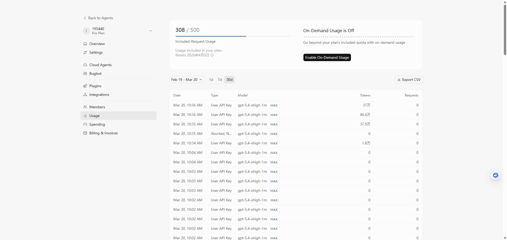
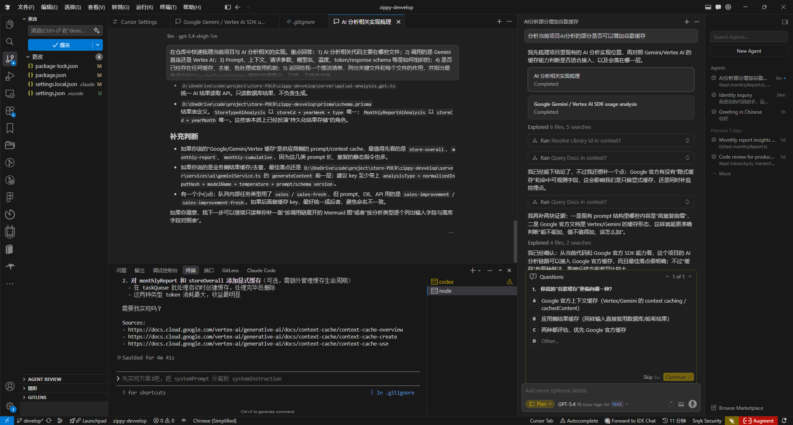

# codex-to-cursor

将 **Codex 侧常见的 Chat Completions（`/v1/chat/completions`）上游**，桥接为 **Cursor 等客户端可走 `POST /v1/responses` 或 `POST /v1/chat/completions`** 的 Node.js 代理服务（前者翻译为上游 Chat Completions 并桥接回 Responses；后者经兼容处理后转发上游）。

## 推荐架构

整体链路建议为：

1. **[Sub2API](https://github.com/Wei-Shaw/sub2api)**（推荐前置）  
   开源 AI API 网关，可把 Codex 等订阅统一成可访问的 OpenAI 兼容端点，便于拿到稳定的 **Base URL + API Key**。官方说明与部署方式见仓库 [README](https://github.com/Wei-Shaw/sub2api/blob/main/README.md)。

2. **本仓库（codex-to-cursor）**  
   监听本地或内网端口，接收 Cursor 发往 **`POST /v1/responses`** 或 **`POST /v1/chat/completions`** 的请求：对 Responses 路径会翻译成上游 **`/v1/chat/completions`** 并把结果桥接回 Responses；对 Chat Completions 路径则做兼容后转发上游。

3. **Cursor**  
   将 OpenAI 兼容 Base URL 指向本服务（见下文示例），在客户端里选用 **Responses** 或 **Chat Completions** 线路均可（视 Cursor 版本与设置项名称而定）。

```
  Cursor
    ├─ POST /v1/responses
    └─ POST /v1/chat/completions
           │
           ▼
  codex-to-cursor ──POST /v1/chat/completions──► Sub2API / Codex 上游
```

## 默认行为说明

- **监听端口**：`3060`（可用环境变量修改）
- **上游地址**：`OPENAI_BASE_URL` 或 `UPSTREAM_BASE_URL`（未设置时保留代码内默认示例地址，**部署请务必改成你的 Sub2API 或 Codex 网关地址**）
- **鉴权**：若请求带有 `Authorization` 头则原样转发；否则使用环境变量 `OPENAI_API_KEY`
- **上游 User-Agent**：默认使用 `codex-tui` 样式 UA，可通过 `UPSTREAM_USER_AGENT` 覆盖
- **Wire API**：对外表现为 **responses**（健康检查 `GET /healthz` 会返回 `wire_api: "responses"`）
- **状态**：`previous_response_id` 等多轮上下文依赖进程内内存；多实例部署时需保持单实例或使用外部状态方案（见 PM2 说明）

## 快速开始

```bash
npm install
cp .env.example .env
# 编辑 .env：填写上游 Sub2API/Codex 的地址与密钥
npm run build
npm run start
```

### 环境变量（`.env`）

| 变量 | 说明 |
|------|------|
| `PORT` | 本服务监听端口，默认 `3060` |
| `OPENAI_BASE_URL` | 上游 OpenAI 兼容根地址（与 Sub2API 文档中的服务地址一致，**不要**带路径后缀如 `/v1`） |
| `UPSTREAM_BASE_URL` | 与 `OPENAI_BASE_URL` 二选一，后者优先 |
| `OPENAI_API_KEY` | 上游 API Key；请求未带 `Authorization` 时使用 |
| `STATE_TTL_SECONDS` | 内存中对话状态保留时间，默认 `86400` |
| `BODY_LIMIT_MB` | 单个请求体大小上限，默认 `20` |
| `UPSTREAM_USER_AGENT` | 转发到上游时携带的 `User-Agent`，未设置时使用内置默认值 |
| `LOG_LEVEL` | 日志级别，默认 `debug` |

## Cursor 侧配置思路

将 Cursor 的 OpenAI 兼容 **Base URL** 设为本服务地址（例如 `http://127.0.0.1:3060`），并配置与 Sub2API 一致的 **API Key**（或通过请求头由本服务转发）。若配置项中有 **Wire API / API 形态** 等选项，可按需选择 **Responses**（走 `POST /v1/responses`）或 **Chat Completions**（走 `POST /v1/chat/completions`）；本服务在 `/healthz` 中仍会报告 `wire_api: "responses"`，表示对 Responses 线路的适配能力。

具体 UI 名称以 Cursor 版本为准；核心是：**客户端无论打上述哪条路径，最终都由本服务对接上游 Chat Completions**。

### 配置截图

下图分别对应 Cursor 官方站点中的使用记录页面，以及 Cursor IDE 中接入本服务后的实际使用界面，可作为配置位置与接入效果的参考。

**图 1：Cursor 站点记录**



**图 2：Cursor IDE 使用**



## 暴露的 HTTP 接口

- `GET /healthz` — 健康检查
- `POST /v1/responses` — 将 Responses 请求翻译为上游 Chat Completions 并返回 Responses 形态结果（含流式子集）
- `POST /v1/chat/completions` — 对部分 Chat Completions 请求做兼容处理后转发上游（便于调试或混合客户端）

其它路径会返回 `404` 说明。

## 使用 PM2 常驻（单实例）

`previous_response_id` 等状态在内存中维护，因此示例配置使用 **fork 模式、单进程**，避免多实例导致上下文不一致。

```bash
npm install
cp .env.example .env
npm run build
npm run pm2:start
npm run pm2:save
```

在目标机器上首次设置开机自启：

```bash
npx pm2 startup
```

按终端提示执行其生成的命令（通常需 `sudo`）。之后进程列表有变更时继续使用 `npm run pm2:save`。

代码或环境变更后：

```bash
npm run build
npm run pm2:restart
npm run pm2:save
```

常用命令：`npm run pm2:status`、`npm run pm2:logs`、`npm run pm2:stop`、`npm run pm2:delete`。

## 能力范围

**已支持（子集）**

- 文本输入
- 图文混合的用户消息
- `instructions`
- 通过进程内存储重放实现的 `previous_response_id`
- `text.format` 中的 `json_object` 与 `json_schema`
- 函数工具与自定义工具
- 非流式与流式 SSE 的部分场景

**不支持**

- Responses 内置工具，例如 `web_search`、`file_search`、`computer_use`、`code_interpreter`、`mcp`
- `conversation`、`prompt`、`include`、`background`、`max_tool_calls` 等
- 音频/文件等多模态（非本文本/图片子集）

## 免责声明

使用第三方网关或中转可能涉及各服务商的用户协议与合规要求，请自行评估风险；本仓库仅提供技术桥接实现，不对上游服务可用性或账号状态负责。

## 许可

本项目采用 **GNU Affero General Public License v3.0**（**AGPL-3.0**）授权，完整条文见仓库根目录 [`LICENSE`](./LICENSE)。概要说明见 [GNU AGPL-3.0 官方页面](https://www.gnu.org/licenses/agpl-3.0.html)。
